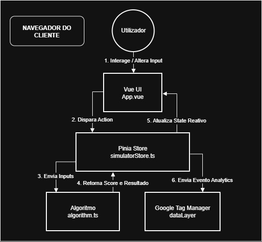

# 📱 Simulador Reparar vs Comprar (Worten)

> **Nota Importante:** Este repositório contém apenas a documentação técnica e demonstração do projeto (Case Study). O código-fonte é propriedade exclusiva da Worten e não está disponível publicamente.

## 👨‍💻 My Role & Responsibility
**Sole Lead Developer (End-to-End Ownership)**

Fui totalmente responsável por todo o ciclo de desenvolvimento (SDLC) deste produto, atuando com autonomia total:

1.  **Architecture:** Desenhei a estrutura de componentes e o fluxo unidirecional de dados (Vue/Pinia).
2.  **Engineering:** Implementei o algoritmo de decisão financeira e a interface responsiva.
3.  **Analytics Strategy:** Desenhei a lógica de tracking avançado para medir a intenção real do utilizador (CTR).
4.  **Quality Assurance:** Defini e implementei a estratégia de testes (Unitários e E2E) para garantir estabilidade em produção.

## 🎯 O Desafio
Desenvolver uma ferramenta interativa para ajudar os clientes da Worten a tomarem decisões financeiras e sustentáveis: *"Vale a pena reparar o meu eletrodoméstico antigo ou comprar um novo?"*.

O desafio técnico envolvia lógica de decisão complexa no frontend, resposta imediata (<50ms) e um tracking de dados granular para análise de funil de analytics.

## 🎥 Demonstração e Interface

*(Clica abaixo para ver o simulador em ação)*

Vídeo [Demonstração do Simulador](simulador.mp4)

Online https://www.worten.pt/servicos-worten-resolve/arranjar-vs-comprar

## 🧠 Arquitetura da Solução
A aplicação segue uma arquitetura orientada a componentes e gestão de estado centralizada. O fluxo de dados é unidirecional para garantir previsibilidade e facilidade de teste.

### Fluxo de Dados (Data Flow):
1.  **Utilizador:** Interage com os componentes UI (Inputs de idade, preço, etc.).
2.  **Vue Component:** Dispara ações para a Store e reage a mudanças de estado.
3.  **Pinia Store:** Atua como a "Single Source of Truth". Gere as regras de negócio e validações.
4.  **Algorithm (Service):** Módulo de lógica pura (testável isoladamente) que devolve o Score de decisão.
5.  **Analytics:** Camada de infraestrutura que observa o estado e dispara eventos qualificados para o Google Tag Manager (GTM).

## 🛠️ Tech Stack Principal
* **Core:** Vue.js 3 (Composition API) & TypeScript (Strict typing)
* **State Management:** Pinia
* **Testing:**
    * **Unit & Integration:** Vitest
    * **E2E (End-to-End):** Playwright
* **Analytics:** Google Analytics 4 (Custom Events)
* **Build Tool:** Vite

## 🚀 Destaques de Engenharia

### 1. Tracking de Visibilidade Real (CTR)
Para medir a real intenção do utilizador, não bastava saber se a página carregou. Implementei um sistema com `IntersectionObserver` que deteta quando os botões de ação (CTA) entram efetivamente no viewport do utilizador.
* **Benefício:** Dados de CTR (Click-Through Rate) purificados, ignorando "bouncers" que não interagiram.

### 2. Estratégia "Anti-Spam" e Deduplicação
Desenvolvi lógica na Store para evitar a poluição de dados analíticos:
* Ignora carregamentos iniciais automáticos (defaults).
* Evita disparos duplicados de "Views" enquanto o utilizador ajusta inputs no mesmo contexto de equipamento.

### 3. Qualidade e Testes
Estratégia de testes abrangente (Testing Pyramid) para garantir estabilidade e confiança:

* **Unit & Integration (Vitest):**
    * Mocks do ambiente Browser (`window`, `dataLayer`) para validação robusta da lógica de negócio e integração com a Store.
    * Testes exaustivos aos cenários matemáticos do algoritmo de decisão.

* **End-to-End (Playwright):**
    * Simulação de jornadas reais do utilizador (User Flows) em browsers reais.
    * Validação funcional dos fluxos críticos (Preenchimento de formulário -> Resultado -> Clique no CTA) em ambiente de produção.

### 4. Interface Responsiva (Mobile-First)
A UI foi desenhada com uma abordagem *Mobile-First* para garantir uma experiência fluida em qualquer dispositivo:
* **Layout Adaptativo:** Utilização de CSS Grid e Flexbox para reorganizar dinamicamente os inputs e painéis de resultados, garantindo legibilidade desde smartphones a monitores ultrawide.
* **Touch-Friendly:** Elementos interativos (botões, dropdowns) dimensionados e espaçados especificamente para uso tátil em mobile, reduzindo a fricção na interação.
---
*Case study desenvolvido por João Martins.*
